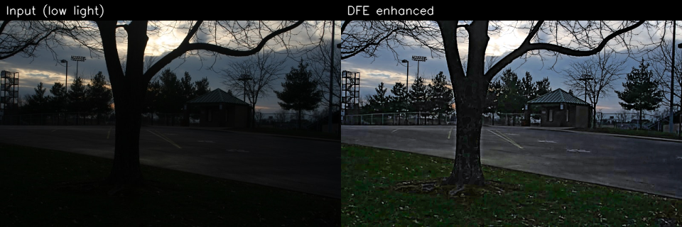
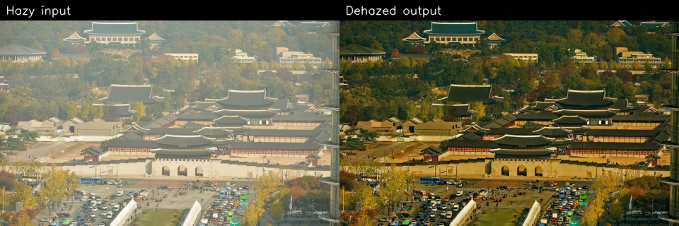
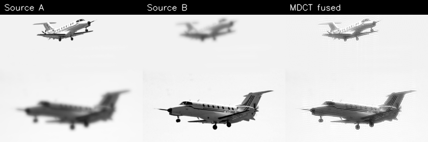
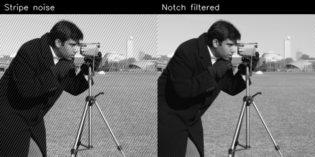

# Illumination Enhancement and Image Fusion

Python implementations of published image-processing methods — enhancement, fusion, dehazing, and classical OpenCV tutorials with GUIs and evaluation metrics.

---

## Why this project matters

This portfolio demonstrates implementation of classical and research-based computer vision algorithms, including enhancement, fusion, dehazing, filtering, frequency-domain processing, and evaluation metrics. Each module is runnable Python code (not slides): you can load a sample image, run the pipeline, and inspect PSNR, SSIM, and other metrics.

---

## Visual results

| Low-light enhancement (DFE) | Image dehazing (bilateral filter) |
|:---:|:---:|
|  |  |

| Multi-focus fusion (MDCT) | Frequency-domain notch filtering |
|:---:|:---:|
|  |  |

---

Python implementations of published image-processing methods, organized into four projects:

1. **Low-illumination image enhancement** — Double-Function Image Enhancement (DFE) based on Retinex theory, with supporting color-balance and baseline methods.
2. **DCT-based image fusion** — Multi-resolution Discrete Cosine Transform (MDCT) fusion for multi-focus and multi-modal images, with a DWT comparison baseline.
3. **Bilateral-filter image dehazing** — Fast single-image dehazing using guided joint bilateral filtering.
4. **Homomorphic image dehazing** — Frequency-domain homomorphic filtering with selectable high-pass filters.

Each project includes a standalone Python script with a Tkinter GUI, sample images (where applicable), a Hebrew-language report PDF, and a MATLAB reference implementation for the dehazing projects.

**OpenCV fundamentals** — a separate set of seven Jupyter notebooks covering classical computer vision (filters, morphology, edges, frequency-domain notch filters, color spaces, segmentation, and classification without ML).

---

## Table of Contents

- [Why this project matters](#why-this-project-matters)
- [Visual results](#visual-results)
- [References](#references)
- [Repository Structure](#repository-structure)
- [Requirements](#requirements)
- [Installation](#installation)
- [Project 1: Low-Illumination Image Enhancement](#project-1-low-illumination-image-enhancement)
- [Project 2: DCT-Based Image Fusion](#project-2-dct-based-image-fusion)
- [Project 3: Bilateral-Filter Image Dehazing](#project-3-bilateral-filter-image-dehazing)
- [Project 4: Homomorphic Image Dehazing](#project-4-homomorphic-image-dehazing)
- [OpenCV Fundamentals (Learning Notebooks)](#opencv-fundamentals-learning-notebooks)
- [License and Attribution](#license-and-attribution)

---

## References

This repository implements algorithms from the following papers:

| Paper | Role in this repo |
|-------|-------------------|
| Chen, L., Liu, Y., Li, G., Hong, J., Li, J., & Peng, J. (2022). *Double-function enhancement algorithm for low-illumination images based on retinex theory.* Journal of the Optical Society of America A, 40(2), 316. [https://doi.org/10.1364/josaa.472785](https://doi.org/10.1364/josaa.472785) | Primary method (**DFE**): multi-scale Retinex + hyperbolic tangent fusion, adaptive gamma, 3D gamma correction, and adaptive saturation in HSV space. |
| Limare, N., Lisani, J., Morel, J., Petro, A. B., & Sbert, C. (2011). *Simplest Color balance.* Image Processing on Line, 1, 297–315. [https://doi.org/10.5201/ipol.2011.llmps-scb](https://doi.org/10.5201/ipol.2011.llmps-scb) | **Simplest Color Balance** (`color_balance`): histogram clipping and contrast stretching applied after DFE output and inside MSRCR. |
| Naidu, V. (2010). *Discrete cosine transform-based image fusion.* Defence Science Journal, 60(1), 48–54. [https://doi.org/10.14429/dsj.60.105](https://doi.org/10.14429/dsj.60.105) | Primary method (**MDCT fusion**): multi-resolution DCT decomposition, subband fusion rules, and inverse reconstruction. |
| Wang, W., & Yuan, X. (2017). *Recent advances in image dehazing.* IEEE/CAA Journal of Automatica Sinica, 4(3), 410–436. [https://doi.org/10.1109/jas.2017.7510532](https://doi.org/10.1109/jas.2017.7510532) | **Homomorphic dehazing**: log-domain homomorphic filtering with GausHP, ButterHP, and IdealHP high-pass transfer functions. |

The bilateral-filter dehazing project implements a fast guided joint bilateral filter pipeline (see `dehaze_algorithm.py` module docstring). Method details are described in the project report PDF.

---

## Repository Structure

```
image_processing/
├── README.md
├── docs/
│   └── assets/                      # README showcase images (before/after)
├── LICENSE                          # MIT License
├── requirements.txt
├── .gitignore
├── scripts/
│   └── generate_readme_assets.py    # Regenerate docs/assets showcase images
│
├── Low-ilumination images enhancement/
│   ├── Image_Enhancement_Report_HE.pdf
│   ├── Code/
│   │   └── Double-function enhancement algorithm.py   # Main script + GUI
│   └── images/
│       ├── lowlight.jpg, NPE_89.png, …                # Sample low-light images
│       └── MEDataset/                                 # Multi-exposure test set
│           ├── chair/, door/, garage/, house/, igloo/, window/
│
├── DCT based image fusion/
│   ├── DCT_Fusion_Report_HE.pdf
│   ├── Code/
│   │   └── DCT - based Image Fusion.py                # Main script + GUI
│   ├── notebooks/
│   │   └── wavelet_analysis.ipynb                     # Wavelet / CWT / DWT tutorial
│   └── Images/
│       ├── img1.png, img2.png, Reference.png          # Quick-start fusion pair
│       └── datasets/
│           ├── CMFDataset/                            # Lytro multi-focus (20 pairs)
│           ├── IVDataset/                             # Infrared / visible pairs
│           └── MDDataset/                             # Medical / CT-MR pairs
│
├── Image dehazing using bilateral filter/
│   ├── Image_Dehazing_using_Bilateral_Filter_HE.pdf
│   ├── Code/
│   │   ├── dehaze_algorithm.py                        # Algorithm functions
│   │   └── FastDehazeImage.py                         # GUI application
│   ├── Images/                                        # Sample hazy images (20 files)
│   └── Matlab/                                        # Reference implementation
│       ├── bilat_dehazing_demo.m
│       ├── bilat_filter.m, bilat_filter_joint.m
│       ├── estimateAtmosphericLight.m
│       └── Fast_Image_Dehaze/
│
├── Homomorphic image dehazing/
│   ├── Homomorphic_Image_Dehazing_HE.pdf
│   ├── Code/
│   │   ├── homomorphic_algorithm.py                   # Algorithm functions
│   │   └── HomomorphicImageDehaze.py                  # GUI application
│   └── Matlab/                                        # Reference implementation
│       ├── homomorphic_filter.m, gaushp.m, butterhp.m, idealhp.m
│       └── Homomorphic_Image_Dehaze/
│
└── OpenCV fundamentals/                               # Classical CV tutorials (no ML)
    ├── Images/                                        # Cached ECE533 downloads (optional)
    └── notebooks/
        ├── 01_spatial_filters.ipynb
        ├── 02_morphological_operations.ipynb
        ├── 03_edge_detection_contours.ipynb
        ├── 04_frequency_notch_filters.ipynb
        ├── 05_color_spaces.ipynb
        ├── 06_classical_segmentation.ipynb
        └── 07_classical_classification.ipynb
```

---

## Requirements

- Python 3.9+
- Dependencies (see `requirements.txt`):

| Package | Purpose |
|---------|---------|
| `numpy`, `scipy` | Array math, DCT, TV denoising |
| `opencv-python` | Image I/O, color spaces, filtering |
| `matplotlib` | Embedded image previews and filter/histogram plots (dehazing GUIs, DFE) |
| `scikit-image` | Adaptive histogram equalization (AHE) |
| `PyWavelets` | DWT baseline for fusion comparison |
| `pandas`, `tabulate` | Metric tables in fusion project |

---

## Installation

```bash
cd image_processing
python -m venv .venv

# Windows
.venv\Scripts\activate

# Linux / macOS
source .venv/bin/activate

pip install -r requirements.txt
```

On Windows, if `python` is not on your PATH, use `py -3` instead (e.g. `py -3 -m venv .venv`).

Run any GUI from its `Code/` folder so local imports resolve, or activate the venv first:

```powershell
# Example — bilateral dehazing
cd "Image dehazing using bilateral filter/Code"
..\..\.venv\Scripts\python.exe FastDehazeImage.py
```

---

## Project 1: Low-Illumination Image Enhancement

**Paper:** Chen et al. (2022) — [DOI 10.1364/josaa.472785](https://doi.org/10.1364/josaa.472785)

**Supporting method:** Limare et al. (2011) Simplest Color Balance — [DOI 10.5201/ipol.2011.llmps-scb](https://doi.org/10.5201/ipol.2011.llmps-scb)

### Overview

The Double-Function Image Enhancement (DFE) algorithm improves low-illumination color images by operating in HSV color space. Brightness and saturation are processed separately, then recombined with the original hue channel. A post-processing color-balance step (Simplest Color Balance) reduces color cast.

### DFE Pipeline

```
Input BGR image
    │
    ├─► HSV split → H (unchanged), S, V
    │
    ├─ V-channel path:
    │     TV denoise → Adaptive gamma → DFIE → 3D gamma correction
    │     I_img = (I_out / 255) × (I_p / 255) × 255
    │
    ├─ S-channel path:
    │     TV denoise → Adaptive saturation adjustment
    │
    └─► HSV merge → I_o → Simplest Color Balance → output
```

### Key Algorithms

| Function | Description |
|----------|-------------|
| `denoise_tv` | Total-variation denoising on V and S channels |
| `adaptive_gamma_transform` | Local mean/variance-based gamma correction |
| `DFIE` | **D**ouble-**F**unction **I**mage **E**nhancement — fuses weighted MSR and multi-scale hyperbolic tangent via adaptive blending coefficient α |
| `three_dim_gamma_correction` | Gamma correction using local max, gradient, and variance |
| `adaptive_saturation_adjustment` | Paper Eq. 25 — local saturation boost for dark regions |
| `color_balance` | Simplest Color Balance (Limare et al.) — percentile histogram clipping |

### Baseline Methods

The GUI and `Model()` function also expose comparison algorithms:

| Model | Description |
|-------|-------------|
| `MSRCR` | Multi-Scale Retinex with Color Restoration |
| `CLAHE` | Contrast Limited Adaptive Histogram Equalization (LAB L-channel) |
| `AHE` | Adaptive Histogram Equalization |

### Default Parameters (DFE)

| Parameter | Default | Description |
|-----------|---------|-------------|
| `sigma` | `10, 100, 300` | Gaussian scales for MSR and tanh branches |
| `weights` | `0.1, 0.1, 0.25` | 3D gamma correction weights |
| `kernel` | `9, 9` | Local window size (n × m) |
| `lam` | `90` | TV denoising weight (λ = 1/weight) |

### Evaluation Metrics

| Metric | Meaning |
|--------|---------|
| **PSNR** | Peak Signal-to-Noise Ratio vs. input (dB) |
| **SSIM** | Structural Similarity Index |
| **SD** | Standard deviation of output histogram (contrast) |
| **IE** | Image entropy (information content) |

### Usage

```bash
cd "Low-ilumination images enhancement/Code"
python "Double-function enhancement algorithm.py"
```

1. Click **Select Image** and choose a low-light image.
2. Pick a model: `DFE`, `MSRCR`, `CLAHE`, or `AHE`.
3. Adjust parameters (DFE exposes sigma, weights, kernel, lambda).
4. Toggle intermediate-result checkboxes to inspect pipeline stages.
5. Click **Run** — right-click any OpenCV window to close.

You can also import `Model()` and the algorithm functions directly from `Double-function enhancement algorithm.py` in your own scripts.

### Sample Images

| Path | Notes |
|------|-------|
| `images/lowlight.jpg` | Quick demo image |
| `images/NPE_89.png` | NPE dataset sample |
| `images/MEDataset/` | Multi-exposure scenes (chair, door, garage, house, igloo, window) |

---

## Project 2: DCT-Based Image Fusion

**Paper:** Naidu (2010) — [DOI 10.14429/dsj.60.105](https://doi.org/10.14429/dsj.60.105)

### Overview

Two partially focused (or multi-modal) grayscale images are fused into a single all-in-focus result using **Multi-Resolution DCT (MDCT)** decomposition. Detail subbands (LH, HL, HH) and the approximation band (LL) are fused independently, then reconstructed with **IMDCT**. A **DWT** path is included as a comparison baseline.

### Fusion Pipeline

```
Image 1 ──► MDCT ──► subbands [LL, LH, HL, HH, …]
Image 2 ──► MDCT ──► subbands [LL, LH, HL, HH, …]
                          │
                          ▼
              Fuse per subband (max / min / mean of |coefficients|)
                          │
                          ▼
                    IMDCT ──► Fused image
```

### Subband Fusion Rules

| Subband | Rule options |
|---------|--------------|
| **Details** (LH, HL, HH) | `max`, `min`, or `mean` of absolute coefficient magnitude |
| **Approximation** (deepest LL) | `max`, `min`, or `mean` |

Ties in max/min rules retain the value from image B.

### DWT Baseline

When **Fusion Model** is set to `DWT`, the same subband fusion rules are applied after `pywt.dwt2` decomposition. Selectable wavelets: `db1`, `db2`, `sym4`.

### Wavelet Analysis Notebook

`DCT based image fusion/notebooks/wavelet_analysis.ipynb` is an interactive tutorial that explains the theory behind the DWT baseline:

- Why wavelets are localized in time and frequency (vs. Fourier / STFT)
- Continuous wavelet transform (CWT) scalograms and CWT vs STFT comparison
- 1D discrete wavelet transform (DWT), filter banks, multi-level decomposition, and reconstruction
- Connection to 2D DWT subbands used in image fusion

Run in Jupyter, VS Code, or Cursor (requires `jupyter` if using the classic notebook server):

```bash
pip install jupyter   # optional — only for `jupyter notebook`
jupyter notebook "DCT based image fusion/notebooks/wavelet_analysis.ipynb"
```

### Evaluation Metrics

| Metric | Requires reference? | Meaning |
|--------|---------------------|---------|
| **PFE** | Yes | Percent Fusion Error (lower is better) |
| **PSNR** | Yes | Peak Signal-to-Noise Ratio (higher is better) |
| **SSIM** | Yes | Mean Structural Similarity (higher is better) |
| **CE** | No | Average cross-entropy between sources and fused image (lower is better) |
| **SD** | No | Standard deviation of fused histogram |
| **SF** | No | Spatial frequency — sharpness measure (higher is better) |

Load **three** images (two sources + reference) to enable PFE, PSNR, SSIM, and the error-map display.

### Usage

```bash
cd "DCT based image fusion/Code"
python "DCT - based Image Fusion.py"
```

1. Click **Select Images From Folder** — choose 2 images (fusion only) or 3 (with reference).
2. Set **Fusion Model** (`DCT` or `DWT`), **Decomposition Level** (1–9), **Details**, and **Approximation** rules.
3. Use display buttons: decomposition mosaic, fusion decomposition, fused result, error map.
4. Click **Calculate Metrics** to print and show the metric table.

**Quick-start images:**

```
DCT based image fusion/Images/img1.png      # Source 1
DCT based image fusion/Images/img2.png      # Source 2
DCT based image fusion/Images/Reference.png # Ground truth (optional)
```

### Datasets

| Dataset | Location | Content |
|---------|----------|---------|
| **CMFDataset** | `Images/datasets/CMFDataset/` | 20 Lytro multi-focus pairs (520×520), `lytro-XX-A/B.jpg` |
| **IVDataset** | `Images/datasets/IVDataset/` | Infrared / visible image pairs |
| **MDDataset** | `Images/datasets/MDDataset/` | Medical multi-modal pairs (CT, MR, SPECT) |

> **CMFDataset citation:** M. Nejati, S. Samavi, S. Shirani, "Multi-focus Image Fusion Using Dictionary-Based Sparse Representation," *Information Fusion*, vol. 25, 2015. [doi:10.1016/j.inffus.2014.10.004](https://doi.org/10.1016/j.inffus.2014.10.004)

---

## Project 3: Bilateral-Filter Image Dehazing

**Report:** `Image dehazing using bilateral filter/Image_Dehazing_using_Bilateral_Filter_HE.pdf`

**Reference:** `Image dehazing using bilateral filter/Matlab/`

### Overview

A hazy RGB image is dehazed using a dark-channel prior refined by median filtering and **guided joint bilateral filtering**. Atmospheric light and a transmission map are estimated, then the scene is recovered via the standard atmospheric scattering model. Optional LAB adaptive histogram equalization boosts contrast on the dehazed result.

### Dehazing Pipeline

```
Hazy BGR image (I)
    │
    ├─► W = min(B, G, R)                         dark-channel proxy
    ├─► V = median-guided refinement of W
    ├─► R = bilat_filter(W)
    ├─► V_R = bilat_filter_joint(V, R)
    ├─► A = min(estimate_atmospheric_light(W), max(255 − W))
    ├─► t = 1 − w · V_R / A
    ├─► J = (I − A) / max(t, t₀) + A             dehazed image
    └─► Optional: LAB adaptive histogram equalization on L
```

### Key Files

| File | Role |
|------|------|
| `dehaze_algorithm.py` | `estimate_atmospheric_light`, `bilat_filter`, `bilat_filter_joint`, `dehaze()` |
| `FastDehazeImage.py` | Tkinter GUI with parameter controls and image previews |

### Default Parameters (GUI)

| Parameter | Default | Control |
|-----------|---------|---------|
| Kernel (`radius`) | 15 | Spinner (1–50, step 2) |
| Omega | 15 | Spinner (1–50, step 2) |
| Sigma_r | 20 | Slider (0.01–100) with tick labels |
| Sigma_t | 20 | Slider (0.01–100) with tick labels |
| `w` | 0.95 | Numeric field |
| `p` | 0.95 | Numeric field |
| `t0` | 0.3 | Fixed internal default |
| W / V / R / V_R / t / J | Off | Vertical On/Off switches |
| Adapt_EQ | Off | Vertical On/Off switch |

`sigma_s` is computed automatically as `0.03 × min(H, W)`.

### GUI Layout

Window **1180×780** (minimum **900×600**), split into a fixed left control column and a resizable preview area.

| Region | Size | Contents |
|--------|------|----------|
| Left panel | 260 px | **Select Image**, status line, Kernel / Omega spinners, **Sigma_r** / **Sigma_t** sliders (tick labels + live value), **w** / **p** fields, vertical switches (W, V, R, V_R, t, J), **Adapt_EQ**, **Run** |
| Right panel | ≥ 640 px | Matplotlib **Original** (top) and **Dehazed (J)** (bottom) — aspect ratio preserved (letterboxed, no stretch) |

**Sigma_r** and **Sigma_t** sliders show tick marks at `0.01, 20, 40, 60, 80, 100` and update the numeric readout while dragging.

Intermediate maps (W, V, R, V_R, t, J) open in separate OpenCV windows when their switch is On.

### GUI Behavior

- **Run** executes dehazing in a **background thread** so the window stays responsive; a progress percentage is shown in the status line.
- Image previews use a debounced matplotlib canvas (`StableFigureCanvas`) so moving or resizing the window does not freeze the UI.
- Panel resize redraws existing previews only — images are not reloaded on every resize event.

### Usage

```bash
cd "Image dehazing using bilateral filter/Code"
python FastDehazeImage.py
```

1. Click **Select Image** and choose a hazy image.
2. Adjust Kernel, Omega, Sigma_r, Sigma_t, w, and p as needed.
3. Turn On any W / V / R / V_R / t / J switch to inspect intermediate maps in pop-up windows.
4. Enable **Adapt_EQ** for optional LAB histogram equalization.
5. Click **Run** — dehazed result appears in the right panel; progress is shown during processing. Right-click OpenCV windows to close.

Import the algorithm directly:

```python
import cv2
from dehaze_algorithm import dehaze

image = cv2.imread("your_hazy_image.jpg")
result = dehaze(image, radius=15, omega=15, sigma_r=20, sigma_t=20, p=0.95, w=0.95, t0=0.3)
dehazed = result["J"]
```

### Sample Images

The `Images/` folder includes 20 hazy test images (outdoor scenes, buildings, roads, and similar). Examples:

| Path | Notes |
|------|-------|
| `Images/road.png` | Road scene |
| `Images/dubai.png` | City skyline |
| `Images/buildings.png` | Urban buildings |
| `Images/hongkong.png` | Harbor view |
| `Images/train_input.png` | Train / fog scene |

> **Note:** Bilateral filtering is O(H × W × radius²) and may be slow on large images.

---

## Project 4: Homomorphic Image Dehazing

**Paper:** Wang & Yuan (2017) — [DOI 10.1109/jas.2017.7510532](https://doi.org/10.1109/jas.2017.7510532)

**Report:** `Homomorphic image dehazing/Homomorphic_Image_Dehazing_HE.pdf`

**Reference:** `Homomorphic image dehazing/Matlab/`

### Overview

A hazy image is dehazed using **homomorphic filtering** in the log-frequency domain. The grayscale image is filtered to suppress low-frequency illumination (haze) while preserving high-frequency detail, then each RGB channel is scaled by the dehazed gray result. Three high-pass filters are available: **GausHP**, **ButterHP**, and **IdealHP**.

### Pipeline

```
RGB image
    │
    ├─► Grayscale I_gray
    ├─► Build H (GausHP / ButterHP / IdealHP)
    ├─► log(1 + I_gray) → FFT → H · spectrum → IFFT → exp − 1 → I_gray_defog
    ├─► I_defog(:,:,c) = RGB(:,:,c) · I_gray_defog
    └─► Optional: LAB adaptive histogram equalization on L
```

### Key Files

| File | Role |
|------|------|
| `homomorphic_algorithm.py` | `gaushp`, `butterhp`, `idealhp`, `homomorphic_filter`, `homomorphic_dehaze()`, `plot_transfer_function()`, `spectrum_to_uint8()` |
| `HomomorphicImageDehaze.py` | Tkinter GUI with filter tabs and image previews |

### Default Parameters

| Filter | Parameters | Defaults |
|--------|------------|----------|
| **GausHP** | D0, C, gL, gH | 1, 2, 0.1, 1.1 |
| **ButterHP** | D0, N | 1, 2 |
| **IdealHP** | D0 | 1 |

### GUI Layout

Window **1180×780** (minimum **900×600**), same split layout as Project 3.

| Region | Size | Contents |
|--------|------|----------|
| Left panel | 270 px | **Select Image**, **Histogram**, filter tabs (GausHP / ButterHP / IdealHP), filter info label, **Disp Selected Filter**, horizontal switches (I_FFT, G\*I_FFT, Dehazed_Gray, Dehazed_RGB), vertical **Adapt_EQ**, **Run** |
| Right panel | ≥ 640 px | Matplotlib **Original** (top) and **Dehazed** (bottom) — aspect ratio preserved |

Filter parameters rebuild the transfer function automatically (debounced **250 ms** after edits). The filter info label shows the active filter type, parameters, and gain range **H**.

**Disp Selected Filter** opens a matplotlib figure with:

- 2D grayscale heatmap of **H(u,v)** (adaptive zoom around DC for small **D0**)
- Radial profile — gain vs. distance from the spectrum center
- 3D surface plot of the filter

FFT debug pop-ups use **log₁p(|spectrum|)** scaling so magnitude structure is visible (not a flat dark image).

### GUI Behavior

- Same debounced `StableFigureCanvas` as Project 3 — moving or resizing the window stays responsive.
- **Run** is fast enough to stay on the main thread; debug FFT / histogram / filter views open in separate matplotlib or OpenCV windows.

### Usage

```bash
cd "Homomorphic image dehazing/Code"
python HomomorphicImageDehaze.py
```

1. Click **Select Image**.
2. Choose a filter tab and set parameters (GausHP is selected by default). The filter info line updates as parameters change.
3. Click **Disp Selected Filter** to inspect **H(u,v)** (heatmap, radial profile, 3D surface), or **Histogram** for the input grayscale.
4. Toggle debug switches to view FFT maps or intermediate results in pop-up windows.
5. Enable **Adapt_EQ** for optional LAB histogram equalization.
6. Click **Run** — dehazed result appears in the right panel.

Import the algorithm directly:

```python
import cv2
from homomorphic_algorithm import build_filter, homomorphic_dehaze

image = cv2.imread("your_hazy_image.jpg")
gray_shape = cv2.cvtColor(image, cv2.COLOR_BGR2GRAY).shape
h = build_filter("gaushp", gray_shape, g_l=0.1, g_h=1.1, d0=1, c=2)
result = homomorphic_dehaze(image, h)
dehazed = result["I_defog"]
```

> **Note:** No sample hazy images are bundled in this project. Reuse images from Project 3 or provide your own.

---

## OpenCV Fundamentals (Learning Notebooks)

Seven interactive Jupyter tutorials for classical computer vision — theory, kernel explanations, and matplotlib demos. No machine learning, no dependency on the four paper-based projects above.

| Notebook | Topics |
|----------|--------|
| `01_spatial_filters.ipynb` | Box, Gaussian, median, bilateral blur; custom kernels (`filter2D`); what each filter does |
| `02_morphological_operations.ipynb` | Erode, dilate, opening, closing; structuring elements |
| `03_edge_detection_contours.ipynb` | Sobel, Scharr, Laplacian, Canny; contours and shape descriptors |
| `04_frequency_notch_filters.ipynb` | 2D FFT, notch reject filters for periodic noise |
| `05_color_spaces.ipynb` | BGR, HSV, LAB, YCrCb; global histogram equalization, CLAHE; color masking |
| `06_classical_segmentation.ipynb` | Thresholding, morphology cleanup, watershed, HSV segmentation |
| `07_classical_classification.ipynb` | Template matching, histogram comparison, ORB features, rule-based labels |

**Image sources:** built-in `skimage.data` test images (camera, coins, astronaut, etc.) and optional cached downloads from the [Wisconsin ECE533](https://homepages.cae.wisc.edu/~ece533/images/) image gallery (`peppers`, `boat`, `baboon`).

Run in Jupyter, VS Code, or Cursor:

```bash
pip install jupyter   # optional — only for `jupyter notebook`
jupyter notebook "OpenCV fundamentals/notebooks/01_spatial_filters.ipynb"
```

Suggested order: 01 → 02 → 03 → 05 → 06 → 07; notebook 04 (frequency domain) is standalone.

---

## License and Attribution

This project is released under the [MIT License](LICENSE) (Copyright 2026 Ruslan).

If you use this code or results in academic work, please cite the original papers listed in [References](#references).

Project reports (Hebrew PDFs):

- `Low-ilumination images enhancement/Image_Enhancement_Report_HE.pdf`
- `DCT based image fusion/DCT_Fusion_Report_HE.pdf`
- `Image dehazing using bilateral filter/Image_Dehazing_using_Bilateral_Filter_HE.pdf`
- `Homomorphic image dehazing/Homomorphic_Image_Dehazing_HE.pdf`
